

*This article was previously hosted on Bevium's website and has since been ported here and improved.*


A flexible, context-aware, multiplayer-ready AI system that leverages GAS at its fullest.


When developing Arcas Champions, we had many requirements: AI that needed to feel human-like, use all the tools that a player could use, and also be able to be scripted for a singleplayer experience (tutorials, and eventually, campaign expansions in the future.)

The existing AI in Lyra did not meet any of these requirements: we scrapped everything and started from scratch, leveraging our extensive use of GAS in order to have the AI bots understand how to mimic player behavior.

In addition, we have extensively used the UE5 perception system, as we had the need for custom perception AI senses, and the EQS system, which enabled us to craft complex behaviors quickly.

Lastly, we made extensive use of Sub-Behavior Trees. While we will not show the whole behavior tree for brevity's sake, this was very important when we had to scale the AI in complexity. Behavior trees get very deep very quickly, and a deep behavior tree is much, much more unwieldy than many, smaller and shallower trees.

## Table of Contents

* [A flexible, context-aware multiplayer-ready AI that leverages GAS at its fullest](#a-flexible-context-aware-multiplayer-ready-ai-that-leverages-gas-at-its-fullest)
* [Requirements overview](#requirements-overview)
* [Static Paths](#static-paths)

  * [Example usage](#example-usage)
* [AI States and Context](#ai-states-and-context)

  * [State](#state)
  * [Context](#context)
* [GAS Integration](#gas-integration)
* [Perception system usage](#perception-system-usage)

  * [FSensedTarget](#fsensedtarget)
* [EQS](#eqs)

  * [EngageEnemy (pick a firing position)](#engageenemy-pick-a-firing-position)
  * [FindCoverFromEnemy (break LOS and relocate)](#findcoverfromenemy-break-los-and-relocate)
* [Conclusion](#conclusion)


## Requirements overview

So, in short, the AI bots for Arcas needed to satisfy the following requirements:
- Be able to move and act like the player,
- Use all of the player available toolset,
- Be scriptable for singleplayer or tutorial content.

Seems simple enough, but under the hood, this trifecta hides many interesting challenges. Let's start with the simplest one.

*EDITOR'S NOTE(09/2026): The singleplayer mode was later cut from the game, sadly.*

## Static Paths

<div style="display:flex;justify-content:center;align-items:center;gap:16px;flex-wrap:wrap;">
  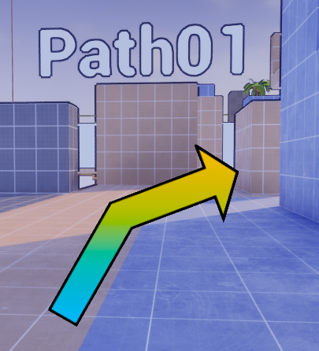
  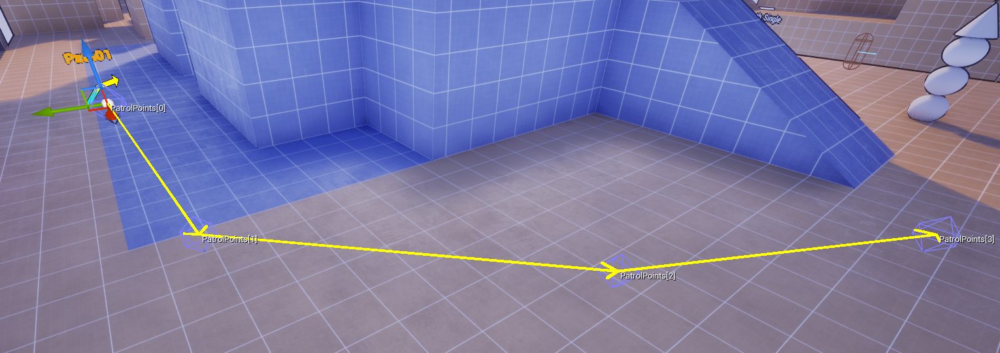
  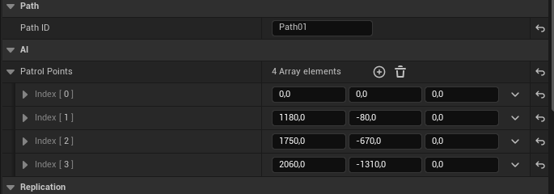
  <br>
  <i><p>From left to right: The path entity, the path's points joined by debug arrows, and the details a designer would see. </i></p>
</div>
<br>

The path entity was kept as simple as possible: a collection of locations, with internal coding that handles which location to send to the AI's knowledge. Here's a simplified flow of the inner workings of this entity:

- AI's state is set to `Patrolling`, checks if a valid path name with the correct identifier exists in the world,
- The Path does not know anything about the AI controller using it,
- The AI's Behavior Tree has a few tasks that handle which patrol point to choose next.
- When reaching the end, we have two options:
  - Retrace the patrol points in reverse order (from last to first)
  - Immediately go back to the first point, after reaching the last point (thus making it possible to create loops).

More bots can follow the same path, they'll never land on the exact position passed by the path point (some randomization can be added, and usually is), and the behavior tree will switch states if something else happens (The Patrol state is very low priority exactly for this reason).

<div style="display:flex;justify-content:center;align-items:center;gap:16px;flex-wrap:wrap;">
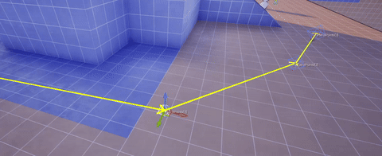
</div>
<div style="display:flex;justify-content:center;align-items:center;gap:16px;flex-wrap:wrap;">
<i>Path points debug arrows changing on PostEdit</i>
</div>
<br>

### Example usage

The first place these systems shipped was the tutorial, with the shopkeeper NPC “Bonzette.”

<div style="display:flex;justify-content:center;align-items:center;gap:16px;flex-wrap:wrap;"> 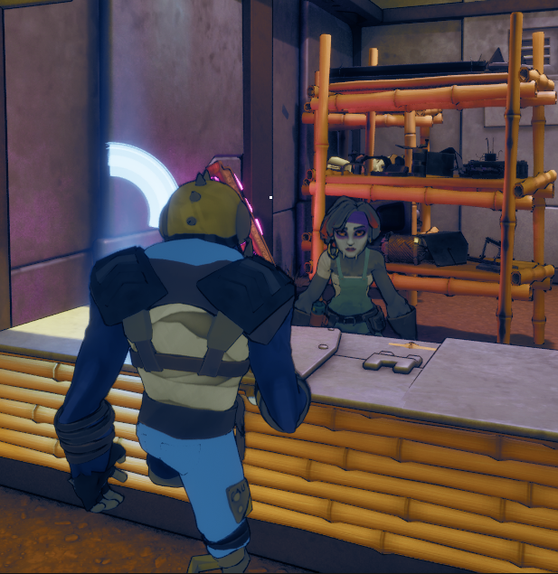 </div> <div style="display:flex;justify-content:center;align-items:center;gap:16px;flex-wrap:wrap;"> <i></i> </div> <br>

Bonzette is not a special-case pawn. She runs the same systems as combat bots. At the start of the tutorial she sits in Patrolling state with a one-point path pinned to her counter. That trick lets designers place “statues” that still feel alive: she idles, tracks the player with look-ats, and responds to perception, yet she does not wander.

When the player completes the first tasks, a simple script flips her goal from hold-position to follow. The behavior tree swaps from the patrol subtree to a follow subtree that keeps a small offset, respects avoidance, and yields on doors and narrow paths so she never body-blocks the player.

<div style="display:flex;justify-content:center;align-items:center;gap:16px;flex-wrap:wrap;"> 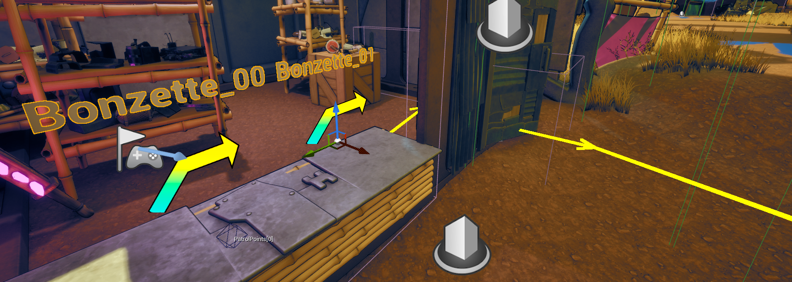 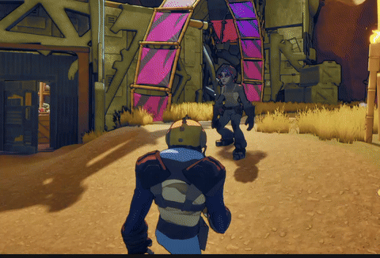 </div> <div style="display:flex;justify-content:center;align-items:center;gap:16px;flex-wrap:wrap;"> <i></i> </div> <br>

From the player’s point of view this reads as a helpful companion who waits behind the counter, then jogs to your side once you are ready to move on.

Bonzette’s job in the tutorial is to introduce the Synergy mechanic. She evaluates and executes the same helper behavior that any ally bot uses in live matches: check that the player is a valid target, check that the upgrade ability is available, ensure safe approach, then execute the ability through GAS.

<div style="display:flex;justify-content:center;align-items:center;gap:16px;flex-wrap:wrap;"> 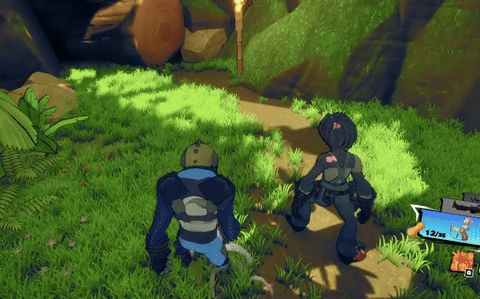 </div> <div style="display:flex;justify-content:center;align-items:center;gap:16px;flex-wrap:wrap;"> <i>Bonzette upgrading the player's turret</i> </div> <br>

Under the hood there is no cinematic track or hidden shortcut. The tutorial only sets the follow target and the step conditions. The upgrade itself flows through the regular subtree that powers co-op support in multiplayer.

<div style="display:flex;justify-content:center;align-items:center;gap:16px;flex-wrap:wrap;"> 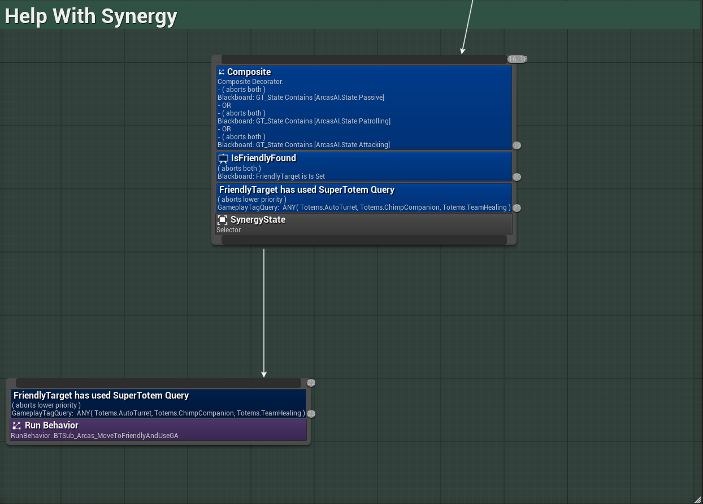 </div> <div style="display:flex;justify-content:center;align-items:center;gap:16px;flex-wrap:wrap;"> <i>Part of the 'Help with Synergy' subtree</i> </div> <br>

## AI States and Context

We used gameplay tags to define the state in which the AI bots find themselves in, which is meant to be unique.
In addition to the **state tags**, we also have **context tags**, which give additional information to the bots regarding the world state or their own equipment. These can be more than one.

So for example, a bot may be in State: `Investigating`, and have the Context tags: `HasGrenade, HasDisguise, HasAutoTurret, HasPrimaryWeaponEquipped` in their respective Gameplay Tag Containers.

### State

<div style="display:flex;justify-content:center;align-items:center;gap:16px;flex-wrap:wrap;">
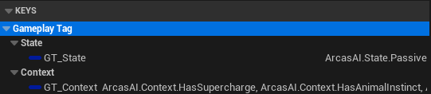
</div>
<div style="display:flex;justify-content:center;align-items:center;gap:16px;flex-wrap:wrap;">
<i>Gameplay Tags Container in the behavior tree</i>
</div>
<br>

We'll touch on the Context container in just a minute, for now, here is all possible tags that can stay in the State container:

```cpp
namespace ArcasAITags
{
    // Parent Tag
    UE_DECLARE_GAMEPLAY_TAG_EXTERN(ArcasAI);

    namespace State
    {
        /* Basic AI States */

        UE_DECLARE_GAMEPLAY_TAG_EXTERN(None);
        UE_DECLARE_GAMEPLAY_TAG_EXTERN(Passive);
        UE_DECLARE_GAMEPLAY_TAG_EXTERN(Investigating);
        UE_DECLARE_GAMEPLAY_TAG_EXTERN(Attacking);
        UE_DECLARE_GAMEPLAY_TAG_EXTERN(HealAttacking); // Used by a particular healing turret
        UE_DECLARE_GAMEPLAY_TAG_EXTERN(ChimpHealing); // Used by a healing AI-controlled chimp
        UE_DECLARE_GAMEPLAY_TAG_EXTERN(Scared);
        UE_DECLARE_GAMEPLAY_TAG_EXTERN(Stunned);
        UE_DECLARE_GAMEPLAY_TAG_EXTERN(Dead);

        /* Loadout-dependant states */

        UE_DECLARE_GAMEPLAY_TAG_EXTERN(Patrolling);
        UE_DECLARE_GAMEPLAY_TAG_EXTERN(Defending);
        UE_DECLARE_GAMEPLAY_TAG_EXTERN(Attacking_Primary);
        UE_DECLARE_GAMEPLAY_TAG_EXTERN(Attacking_Secondary);
        UE_DECLARE_GAMEPLAY_TAG_EXTERN(Attacking_Melee);

        /* Totem Tags */

        UE_DECLARE_GAMEPLAY_TAG_EXTERN(DamageTotem);
        UE_DECLARE_GAMEPLAY_TAG_EXTERN(PersonalTotem);
        UE_DECLARE_GAMEPLAY_TAG_EXTERN(SupportTotem);
    }
}
```

In the behavior tree, the state priority is declared exactly as follows:
- Stunned
- Dead
- Scared
- Attacking
- Investigating
- Patrolling
- Passive

In truth, there is C++ code in the controller that ensures that two states can never run concurrently, as the behavior tree makes the strong assumption that the AI agent can only ever run one state at a time.

Now the Context tags are a bit different:

### Context

```cpp
namespace Context
{
    /* Context Tags */

    UE_DECLARE_GAMEPLAY_TAG_EXTERN(None);
    UE_DECLARE_GAMEPLAY_TAG_EXTERN(Hotspot);
    UE_DECLARE_GAMEPLAY_TAG_EXTERN(Gliding);
    // Damage Abilities
    UE_DECLARE_GAMEPLAY_TAG_EXTERN(HasGrenade);
    UE_DECLARE_GAMEPLAY_TAG_EXTERN(HasSupercharge);
    UE_DECLARE_GAMEPLAY_TAG_EXTERN(HasRage);
    // Personal Abilities
    UE_DECLARE_GAMEPLAY_TAG_EXTERN(HasPersonalHealing);
    UE_DECLARE_GAMEPLAY_TAG_EXTERN(HasAmmoCrate);
    UE_DECLARE_GAMEPLAY_TAG_EXTERN(HasDisguise);
    UE_DECLARE_GAMEPLAY_TAG_EXTERN(HasAnimalInstinct);
    // SynergyTotem Abilities
    UE_DECLARE_GAMEPLAY_TAG_EXTERN(HasTeamHealing);
    UE_DECLARE_GAMEPLAY_TAG_EXTERN(HasChimpCompanion);
    UE_DECLARE_GAMEPLAY_TAG_EXTERN(HasAutoTurret);
    // Weapon-Specific Context Tags
    UE_DECLARE_GAMEPLAY_TAG_EXTERN(HasPrimaryWeaponEquipped);
    UE_DECLARE_GAMEPLAY_TAG_EXTERN(HasSecondaryWeaponEquipped);
    UE_DECLARE_GAMEPLAY_TAG_EXTERN(HasLongRangeWeaponEquipped);
    UE_DECLARE_GAMEPLAY_TAG_EXTERN(HasMeleeWeaponEquipped);
}
```

These context tags are applied by a Behavior Tree Service, that only really 'Ticks' when it detects a change in loadout (so it's not even really a tick anymore). Meaning we can efficiently listen to loadout changes at runtime, and the AI will adapt itself accordingly.

For example, let's see how the Gliding tag works. The players can glide with their chicken, so the bots must also be able to.

<div style="display:flex;justify-content:center;align-items:center;gap:16px;flex-wrap:wrap;">
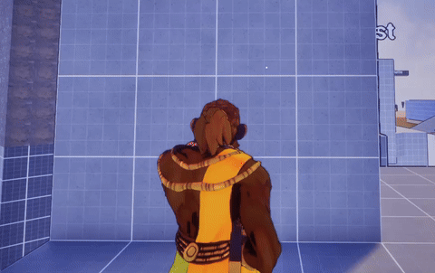
</div>
<br>

What happened behind the scenes here, is that the bots can only jump gaps in the map by using nodes manually placed by level designers. We have very few, tightly designed arena-style maps, so this approach is feasible.

The jump node automatically informs any AI using it that it is a gliding node, and applies the tag. The Behavior tree then mimics exactly the same flow that the player does when calling gliding (all the day down to the input), and voilà.

As you can probably imagine, more than one context tag can be applied. For example, if a bot has a sniper rifle, its `GT_Context` container will also contain `HasPrimaryWeaponEquipped` and `HasLongRangeWeaponEquipped`. This will result in special behavior where, in the attacking state, the bot will still act and use the 'primary weapon' attack features, but it will also automatically take into account that it has a long range weapon.

While this system may seem tedious at first glance, imagine the scope of a always-updated multiplayer game: with this system, we define behaviors based on the requirements, and then these behaviors will still work even if the designers add more long range weapons, melee weapons, etc...

## GAS Integration

You have seen all of the tags, referring to in-game equipment. That's exactly because we needed to integrate our player-centric, multiplayer-ready implementation of GAS to the AI system, and do so in a way that wasn't just 'use random ability at random time'.

To follow the same leitmotiv, we defined behaviors for every possible ability (as we knew we had a hard requirement that the game would only have a certain amount of abilities), and fine-tuned every behavior to be as smart and human-like as possible.

<div style="display:flex;justify-content:center;align-items:center;gap:16px;flex-wrap:wrap;">
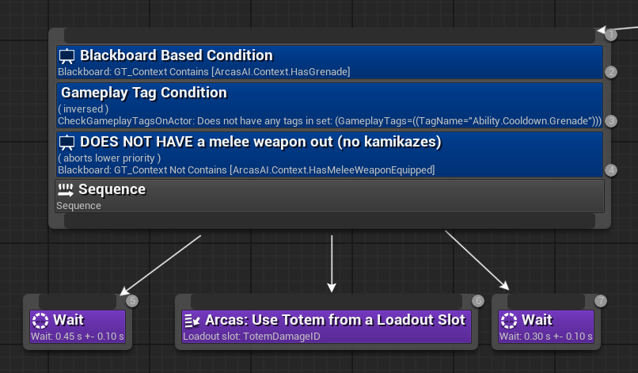
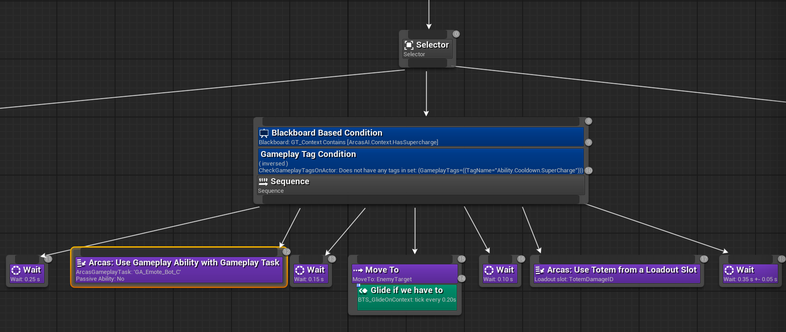
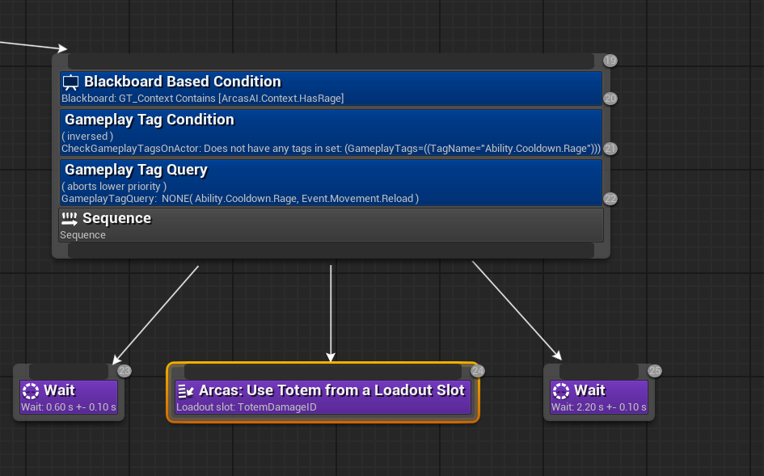
<i>An example of the damage abilities in the game and their behavior.</i>
</div>
<br>

The 'Arcas: [...]' nodes you see are custom BT Tasks coded in C++ for efficiency: we differentiate between 'Fire and Forget' abilities (e.g. launching a grenade is a one-time action), and abilities that require a lengthy, blocking animation, or that are passive.

These three subtrees feature exactly these three kind of abilities: the grenade is fire and forget, as we've just said, the supercharge will only complete if the bot manages to do a certain animation, and rage is a passive damage and speed boost that lasts for a few seconds.

## Perception system usage

All bots are capable of sight, hearing, and damage sensing.
For example, if the bots hear certain suspicious sounds, or see you and then lose sight of you, they'll go into the investigate state (from their Passive / Patrol states).
Similarly, if you damage them, they'll investigate and if they find you, they'll go into attacking.

In addition, we have implemented a special sight for the artillery cannon, showcased here (follow the orange ball that tracks the player):

<div style="display:flex;justify-content:center;align-items:center;gap:16px;flex-wrap:wrap;">
<iframe width="560" height="315" src="https://www.youtube.com/embed/tdTxME0jRA4?si=tWhOZAgqoCbzjA_R" title="Arcas Champions Custom Perception" frameborder="0" allow="accelerometer; autoplay; clipboard-write; encrypted-media; gyroscope; picture-in-picture; web-share" referrerpolicy="strict-origin-when-cross-origin" allowfullscreen></iframe>
</div>
<br>

This sense not only features 'enemy' tracking through walls, but also dynamic sight radius change at runtime. In fact, this artillery cannon is dependant on a spotter entity, that randomly spawns in the map.

If the spotter gets killed by the players, then the artillery cannon's sight radius gets drastically reduced. Unreal Engine 5 is not really capable of this out of the box, and it's especially hard on multiplayer.

### FSensedTarget

Going back to human-like bots, we need to remember all the targets we've sensed. This is because, whenever a bot loses sight of a target, if other targets remain in sight, it will not automagically count them as valid again.

And so, we keep an array of recently sensed targets, so that whenever we lose sight of one, the bot will check in its array of Sensed Target if another one is still present in its sights:

```cpp
USTRUCT()
struct FSensedTarget
{
  GENERATED_BODY()

  /** Weak pointer for safety */
  UPROPERTY()
  TWeakObjectPtr<AActor> Target;

  /** Time (in seconds) the target was last confirmed in sight */
  float LastSensedTime;

  /** Let's get the stimulus max age from the perception system */
  float StimulusMaxAge;

  FSensedTarget() : Target(nullptr), LastSensedTime(0.f), StimulusMaxAge(0.f) {}
  FSensedTarget(AActor* InTarget, float InTime, float inStimulusMaxAge) :
                Target(InTarget), LastSensedTime(InTime), StimulusMaxAge(inStimulusMaxAge) {}
};
```


```cpp
  /** Two arrays: one for friendly, one of enemies. */

  UPROPERTY(Transient)
  TArray<FSensedTarget> SensedEnemyTargets;

  UPROPERTY(Transient)
  TArray<FSensedTarget> SensedFriendlyTargets;
```

While we cannot show the whole code (it's part of the sight handling function as a whole), we iterate over both arrays, cleanup any invalid targets, and if there is another valid target (based on heuristics such as distance from the character, etc...) then we swap the focus on that one.

## EQS

We use two tightly scoped queries that cover 90% of our tactical movement: EngageEnemy (pick a good firing position) and FindCoverFromEnemy (break line-of-sight and relocate). Both run on the server, are throttled by state (only while Attacking/Investigating), and are parameterized by context tags (e.g., HasLongRangeWeaponEquipped increases “prefer farther from target” weights).

### EngageEnemy (pick a firing position)

**Intent**. Keep or acquire line-of-sight, maintain a comfortable standoff, and avoid big relocations unless forced.

- **Generator**. Simple Grid around the Querier (bot): radius ~1800, spacing ~320, projected onto navmesh.

Tests (in order).

- PathExist (from Querier): filter only; unreachable points are discarded.

- Visibility Trace (to TargetEnemy): require hit; we only consider points with clear LOS.

- Distance to TargetEnemy: soft floor around ~200 units; prefer greater (weight \(\simeq\) 1.65) so melee won’t close in unnecessarily while rifle users keep healthy range.

- Distance to Querier: prefer lesser (weight \(\simeq\) 2.2) to favor micro-repositioning/strafe over long sprints.

What actually happens after all these parameters: the bot “orbits” with short strafes that preserve LOS, nudging toward safer ranges for the current weapon. If the trace test fails for most points (enemy behind hard cover), the BT falls back to FindCoverFromEnemy or an Investigate sweep depending on state.

<div style="display:flex;justify-content:center;align-items:center;gap:16px;flex-wrap:wrap;">
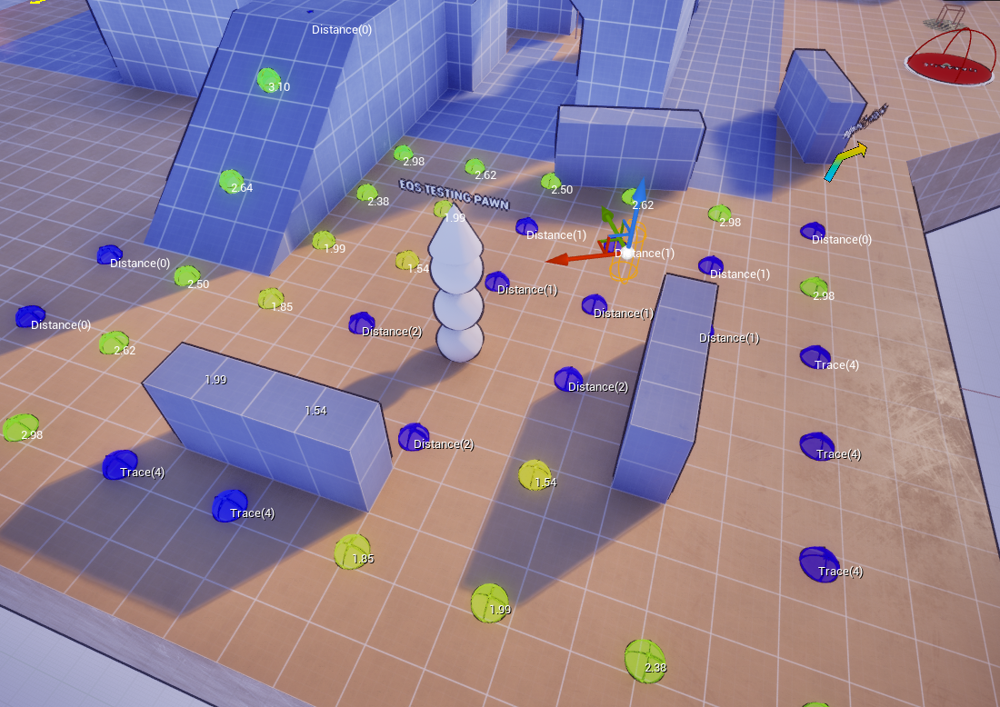
</div>
<div style="display:flex;justify-content:center;align-items:center;gap:16px;flex-wrap:wrap;">
<i>Result of the Engage Enemy EQS</i>
</div>
<br>

### FindCoverFromEnemy (break LOS and relocate)

**Intent**. Get out of sight quickly, then bias toward positions that are costly for the enemy to reach and tactically useful to re-engage.

**Generator**. Simple Grid around TargetEnemy: radius ~900, spacing ~250. Centering on the threat helps sample occluders relevant to the enemy’s vantage.

Tests (in order).

- PathExist (from Querier): filter only; unreachable points are discarded (constant score).

- Visibility Trace (to TargetEnemy): require not hit; candidate must be occluded.

- Distance to TargetEnemy (cap): prefer greater up to ~1000 units (light weight) to avoid hugging corners that still allow easy pre-fire.

- Distance to Querier (min hop): require \(\geq\) ~350 units (no score) to force an actual relocation, not a sidestep.

- Distance to TargetEnemy (floor): require \(\geq\) ~300, then prefer greater (moderate weight) to bias to safer standoff once hidden.

- Distance to Querier (spread): prefer greater (light weight) so multiple bots don’t collapse into the same pocket.

- PathCost (from TargetEnemy): prefer greater; favors spots that are expensive for the enemy to push (useful versus shotgunners/melee).

Behavioral result. The bot snaps to genuine cover (no LOS), chooses spots that deter enemy chase, and creates space to heal/reload or switch to a long-range plan. If no valid cover is found, we return the best LOS-maintaining point from EngageEnemy and raise aggression cautiously.

<div style="display:flex;justify-content:center;align-items:center;gap:16px;flex-wrap:wrap;">
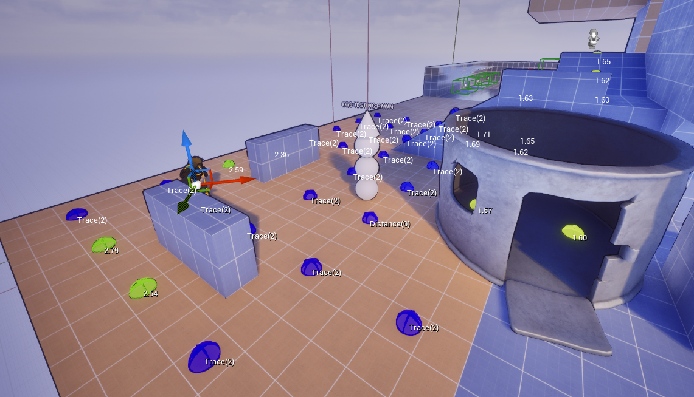
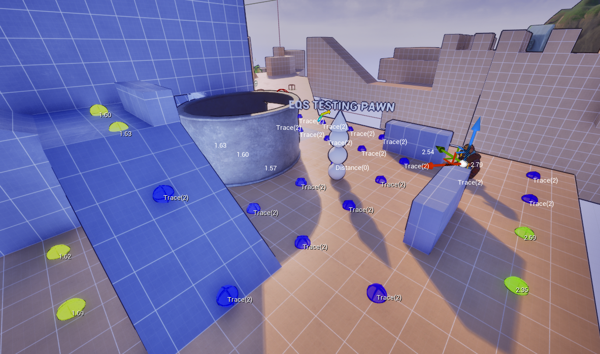
</div>
<div style="display:flex;justify-content:center;align-items:center;gap:16px;flex-wrap:wrap;">
<i>Result of the Find Cover EQS</i>
</div>
<br>

As a sidenote: we have additional behavior for bots that are hidden (such as healing, or disguising). This drives emergent behavior that even suprised other fellow developers in testing!

These two queries keep trees shallow and legible: EngageEnemy handles the continuous micro-movement while fighting; FindCoverFromEnemy is the discrete “oh no, I’m losing this angle” escape valve that unlocks healing, reloads, and flanks.

## Conclusion

Building the ArcasAI system meant treating bots as first-class players, not scripted props. Starting from a clean slate gave us room to align everything: perception, decision-making, movement, and abilities around a single idea: the AI should use the same tools, rules, and constraints as human players.
That’s why GAS drives actions, gameplay tags define both state and context, Sub-Behavior Trees keep logic shallow and composable, and a small amount of EQS queries (of which we've examined “EngageEnemy” and “FindCoverFromEnemy”) handle most tactical repositioning and objective pathing without turning the tree into spaghetti.

The payoff is practical: designers author paths, hotspots, and jump/glide affordances with predictable results; the same BTs scale from a scripted tutorial companion (Bonzette) to chaotic multiplayer fights; and when we add a new weapon or ability, the bots inherit sensible behavior through tags rather than bespoke code. The system is flexible where it matters and opinionated where it saves time.

If there’s a lesson in this retrospect, it’s that AI for a live, multiplayer game benefits from a few durable patterns:

- keep trees shallow, push nuance into data (tags, EQS weights, loadout services);

- prefer server-auth flows that mirror the player pipeline (ASC → abilities → cues);

- invest early in authoring ergonomics and debugging (visual EQS, tag inspectors, path gizmos).

From here the roadmap is refinement, not reinvention: tighten difficulty presets and aim curves, improve squad spacing and role selection, and add more designer-driven behaviors through existing hooks.
Furthermore, there are already some additional parameters which just lay unused, but the implementation is present: ideas such as a bot's aggressiveness level, custom class based on its loadout, etc...
We’ll expand the EQS set (flank routes, anti-rush, retreat corridors), expose tag-driven weights in data assets, and add focused services for peek timing, aim settling, and threat-memory decay so decisions are easy to read in playtests. The core contracts stay stable: tags, Sub-BTs, EQS, GAS. Content keeps growing on top without touching controller code.
