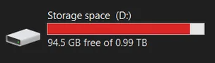
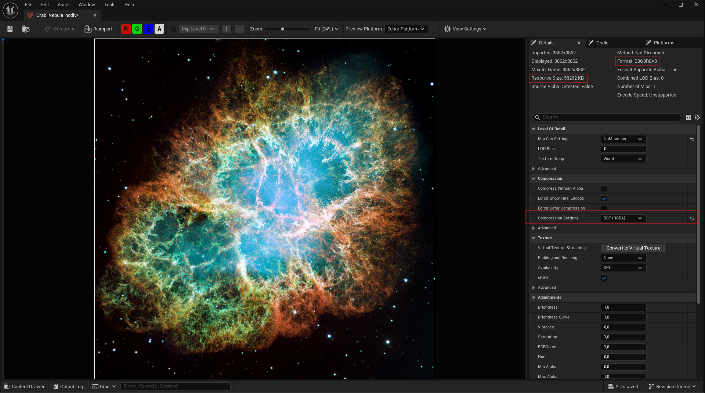
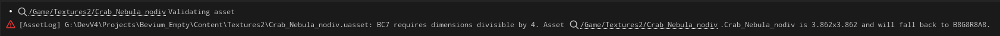

*This article was previously hosted on Bevium's website and has since been ported here and improved.*

## When the setting says BC7 but the format does not


<br>

Texture memory problems are easy to miss because the asset still looks correct. In this case I selected `BC7 (RGBA)` in Unreal Engine 5.6, but the texture statistics reported `B8G8R8A8`. The setting described what I had requested; the **Format** field showed what the editor had actually built.

The source texture was 3862×3862, so neither dimension was divisible by four. With padding and resizing disabled, this UE5.6 editor build did not produce BC7 data and used an uncompressed 32-bit format instead. There was no obvious warning in the Texture Editor.

BC7 works in fixed 4×4 blocks. Each block occupies 16 bytes, which averages out to **1 byte per texel**. The same 16 texels occupy 64 bytes in B8G8R8A8, or **4 bytes per texel**. That explains the nearly fourfold difference in the example below. [Microsoft's BC7 documentation](https://learn.microsoft.com/en-us/windows/win32/direct3d11/bc7-format) describes the 4×4 tile and 16-byte block layout.

One qualification matters here: “the encoder cannot tile it” would be too broad. Tools can pad an image to whole blocks, and Unreal has padding and resizing settings. The observed fallback applies to the configuration shown below; another engine version, target platform, or texture-build configuration may handle the source differently.

## Testing

I tested this with an image of the Crab Nebula:

- **Source dimensions:** 3862×3862, not divisible by four
- **Source file on disk:** 26.8 MB
- **Texture settings:** no mipmaps, no padding or resizing
- **Preview target:** Editor Platform


<br>

Although **BC7 (RGBA)** was selected, the statistics panel reported **B8G8R8A8** and a resource size of **58,262 KB**.

That number is not directly comparable to the 26.8 MB source file. PNG, JPEG, and similar source formats describe storage on disk; Unreal's **Resource Size** describes the built texture resource. Package compression and systems such as Oodle can change the shipped size again. This test is mainly about the runtime texture footprint, not a guaranteed fourfold increase in download size.

I then changed both dimensions to 3864×3864. The image is still non-power-of-two, but it now fits the 4×4 block grid.


<br>

This time the Format field reported **BC7**, with a resource size of **14,581 KB**. Compared with the 58,262 KB fallback, that is almost exactly one quarter of the memory: a reduction of about **75%**, not 45%. The previous 45% figure only worked if 14.58 MB was compared with the separately compressed 26.8 MB source file, which is not the useful comparison here.

Non-power-of-two and block-misaligned are not the same thing. [Since UE5.1](https://dev.epicgames.com/documentation/en-us/unreal-engine/unreal-engine-5.1-release-notes?application_version=5.1), Unreal can generate mipmaps for non-power-of-two textures whose dimensions are divisible by four, although the result can still vary by platform and may not save memory over the next power-of-two size. UI textures often do not need mipmaps or streaming, but BC7 is lossy, so fine text and sharp graphic elements still deserve a visual check.

The most useful habit is to read the **Format** and **Resource Size** fields instead of trusting the compression-setting label alone. Check the preview or cooked target that you actually intend to ship: BC7 support and texture formats are platform-dependent. B8G8R8A8 is not always a mistake either; uncompressed storage can be a deliberate quality choice for UI or data textures.

A related format choice is worth clarifying: BC3 is not smaller than BC7. Both use 16 bytes per 4×4 block. BC1 uses 8 bytes per block and can halve the footprint again, but it has more limited color and alpha representation. Choose a format based on channels, quality, and target support—not its name alone.

## Catching the mismatch with editor validation

The following validator turns the “dimensions divisible by four” requirement into a project rule. It checks textures explicitly configured for BC7 and reports incompatible source dimensions during Unreal's validation flow.

This is deliberately a policy check, not proof of the final cooked pixel format. It does not account for automatic padding, resizing, or platform-specific format selection. Adjust the rule if your pipeline intentionally uses any of those features.

Place this class in an **Editor-only module**. `UEditorValidatorBase`, `UnrealEd`, and the validation tooling should not become dependencies of a shipping runtime module. Depending on your module layout, add `DataValidation`, `AssetRegistry`, and any required editor dependencies to that module's `Build.cs` file. Also make sure the Data Validation plugin is enabled.

#### Header file

```cpp

#pragma once

#include "CoreMinimal.h"
#include "EditorValidatorBase.h"
#include "BC7TextureValidator.generated.h"

UCLASS()
class UBC7TextureValidator : public UEditorValidatorBase
{
    GENERATED_BODY()

public:
    UBC7TextureValidator();

    // UE5.6 overloads with asset data and validation context.
    virtual bool CanValidateAsset_Implementation(const FAssetData& InAssetData,
                                                 UObject* InObject,
                                                 FDataValidationContext& InContext) const override;

    virtual EDataValidationResult ValidateLoadedAsset_Implementation(const FAssetData& InAssetData,
                                                                      UObject* InAsset,
                                                                      FDataValidationContext& Context) override;
};

```

#### Source file

```cpp
#include "BC7TextureValidator.h"
#include "Engine/Texture2D.h"
#include "AssetRegistry/AssetData.h"
#include "Misc/DataValidation.h"

UBC7TextureValidator::UBC7TextureValidator()
{
    bIsEnabled = true;
}

bool UBC7TextureValidator::CanValidateAsset_Implementation(const FAssetData& InAssetData,
                                                           UObject* InObject,
                                                           FDataValidationContext& /*InContext*/) const
{
    const bool IsTextureByClass = (InAssetData.AssetClassPath == UTexture2D::StaticClass()->GetClassPathName());
    const bool IsTextureByObject = (InObject && InObject->IsA(UTexture2D::StaticClass()));
    return IsTextureByClass || IsTextureByObject;
}

EDataValidationResult UBC7TextureValidator::ValidateLoadedAsset_Implementation(const FAssetData& /*InAssetData*/,
                                                                               UObject* InAsset,
                                                                               FDataValidationContext& /*Context*/)
{
    const UTexture2D* Tex = Cast<UTexture2D>(InAsset);
    if (!Tex)
    {
        AssetFails(InAsset, NSLOCTEXT("BC7Validator", "UnexpectedType",
                                      "BC7 validator expected a Texture2D but received a different type."));
        return EDataValidationResult::Invalid;
    }

    const int32 Width = Tex->Source.GetSizeX();
    const int32 Height = Tex->Source.GetSizeY();

    if (Tex->CompressionSettings != TC_BC7)
    {
        AssetPasses(Tex);
        return EDataValidationResult::Valid;
    }

    const bool BadDims = ((Width % 4) != 0) || ((Height % 4) != 0);

    if (BadDims)
    {
        const FText Error = FText::Format(
            NSLOCTEXT("BC7Validator", "BadDims",
                      "BC7 requires dimensions divisible by 4 in this pipeline. Asset {0} is {1}x{2}; review its source dimensions and padding settings."),
            FText::FromString(Tex->GetPathName()), FText::AsNumber(Width), FText::AsNumber(Height));

        AssetFails(Tex, Error);
        return EDataValidationResult::Invalid;
    }

    AssetPasses(Tex);
    return EDataValidationResult::Valid;
}

```

The sample uses the `UEditorValidatorBase` overloads available in Unreal Engine 5.6. It checks every `Texture2D`, passes textures that do not request BC7, and fails BC7 textures whose source dimensions are not divisible by four. Calling `AssetPasses` and `AssetFails` is important: those functions record the validator's result rather than merely returning an enum.


<br>

The validation message identifies the asset and its dimensions, so the source image or padding policy can be reviewed before the problem reaches a cook. [Unreal's Data Validation system](https://dev.epicgames.com/documentation/en-us/unreal-engine/data-validation-in-unreal-engine) can run C++ validators from the editor or through a commandlet in CI.

## Conclusions

The useful takeaway is narrower than “every texture must be power-of-two.” If a texture is intended for BC7 but the Format field reports B8G8R8A8, check whether its dimensions fit the 4×4 block grid and whether padding or resizing is enabled. In this test, changing each axis by two pixels reduced the reported resource size from 58,262 KB to 14,581 KB.

That result describes one UE5.6 editor configuration and one preview target. Treat the built format and resource size as the evidence, verify important shipping platforms separately, and remember that GPU memory, source-file size, and packaged download size are three different measurements.
