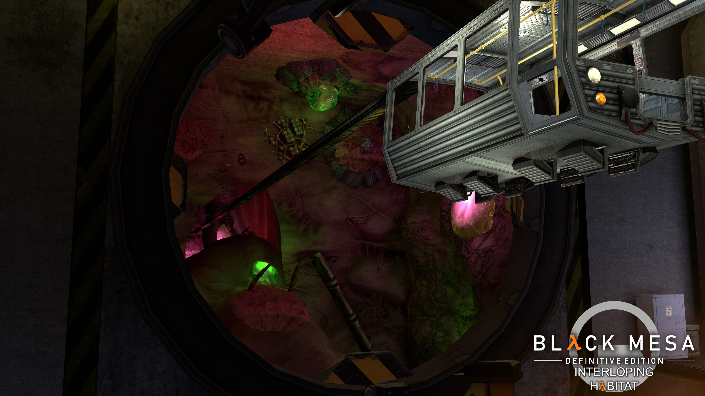
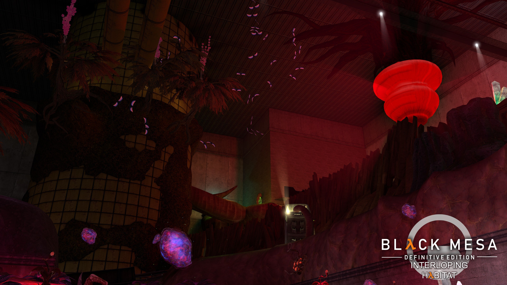
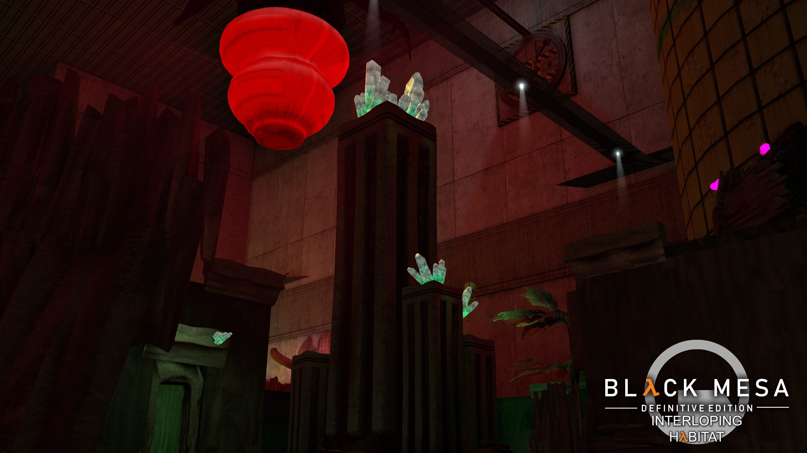
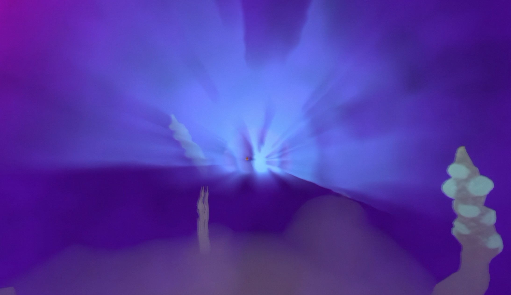
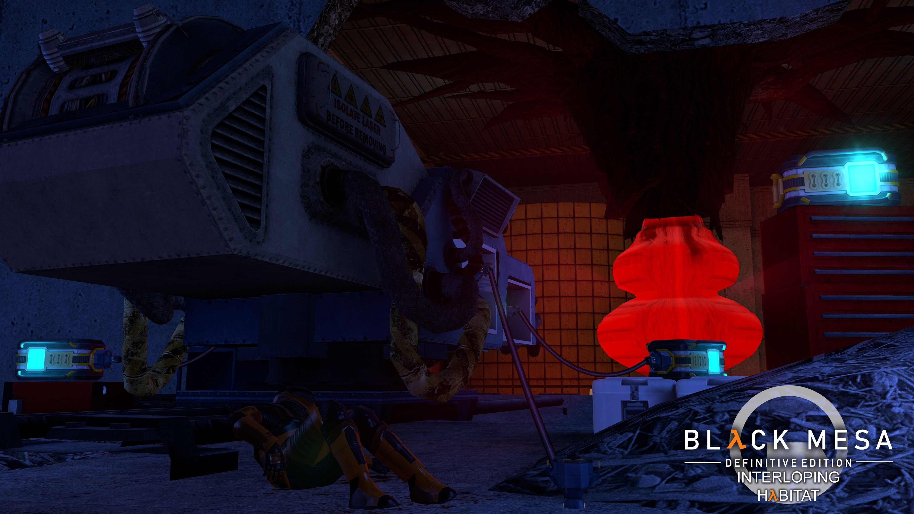
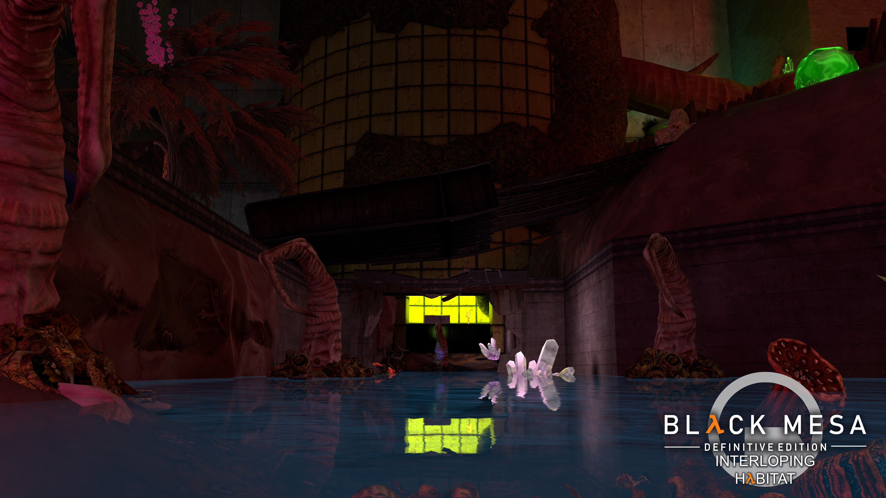


Welcome to the Habitat. A distant corner of Black Mesa is being eaten alive and rebuilt into something considerably more Xenian.


*The opening I built for the campaign: one last tram ride before Gordon is dropped directly into the problem.*



  <article>
    Type
    <strong>Collaborative single-player campaign</strong>
    
Two large Black Mesa levels built with my dear friend Kafe, of Splash Damage fame.

  </article>
  <article>
    My work
    <strong>Introduction and The Marsh</strong>
    
Layout, encounter pacing, underwater traversal, environment work, and final implementation.

  </article>
  <article>
    Stack
    <strong>Source Engine, Hammer, Black Mesa</strong>
    
Working with a dated, yet proven and amazing editor and the then-new Black Mesa Xen toolset.

  </article>


 Black Mesa 
 Source Engine 
 Hammer Map Editor 
 Miro 


## Welcome to the Habitat

With the Resonance Cascade in full effect, an unknown biomass has broken into a distant sector of Black Mesa. It does not simply infest the facility: it consumes it and grotesquely morphs what remains into a new Xenian habitat.

The resident science team had already assembled a way to stop it. Then the HECU arrived, massacred the people who understood the plan, and were left trying to reconstruct it from whatever remained. Gordon, naturally, walks straight into the middle of all this.

The campaign is split into two large levels. Kafe built *The Habitat*, taking the player through laboratories and enormous Xen enclosures toward the source of the infestation. I worked on the introduction shown above and built *The Marsh*, where the operation—and the biomass—finally comes to a head.

## The Marsh

*The facility is still visible, but it is nearly fully consumed. I wanted the Xen growth to feel less like decoration and more like a new environment forcing itself through the old one. Taking inspiration from the Flood from Halo.*

The Marsh is the centre of the biomass: a wild, half-flooded Xenian ecosystem growing inside what remains of Black Mesa. The route alternates between larger combat spaces and tighter traversal, with industrial landmarks keeping the player oriented while the organic shapes do their best to ruin that plan.

*The large enclosures let me push the scale much further than the opening while still using the surviving concrete architecture as a readable frame.*

## Yes, There Is an Underwater Section

Because underwater sections have such an impeccable reputation in videogames, I obviously decided The Marsh needed one. I mostly liked the effects that the new godrays added to the game, and so I did my best to design a section that was quick, bearable, and full of little secrets.

*The flooded route breaks up the combat and makes the infestation feel physically deeper than the visible surface. It also meant solving the usual underwater problems: direction, visibility, pacing, and convincing players that yes, they really do have to go down there.*

Jokes aside, the section had to remain legible without losing the alien atmosphere. Light, colour, and recognizable facility geometry became much more important once normal movement and sightlines were taken away from the player.

I also played around with some "pareidoliac" shapes, helped by the foggy water. And finally, I had an excuse to use the new underwater barnacles :)

## Salvaging the Operation

*The aftermath of the failed HECU operation runs through the level: abandoned equipment, dead soldiers, and pieces of a solution nobody alive fully understands anymore.*

That setup gave the level a useful objective beyond simply moving through another Xen-infested facility. Gordon is retracing a broken plan, recovering whatever still works, and pushing toward the centre before the biomass consumes the rest.

## From Graybox to Release

I took my portion from the first layout pass through encounter iteration, environment work, and final implementation. The graybox had to function as movement space, combat space, and navigational space before any amount of glowing alien vegetation could make it look finished.

This was also built around features introduced with Black Mesa's Xen update, in an engine branch that was not especially well documented at the time. A lot of the workflow came down to testing behaviour directly and learning where the tools stopped agreeing with the documentation. The new lighting system was especially esoteric: it mimicked ideas present in Unreal Engine 4, but kept that unmistakable Source Engine feeling.

That is probably why this project still represents me rather well. I enjoy building playable spaces, not only systems, and I like staying close to what the player actually sees and does. Also, apparently, I can never stay away from modding games for very long.

