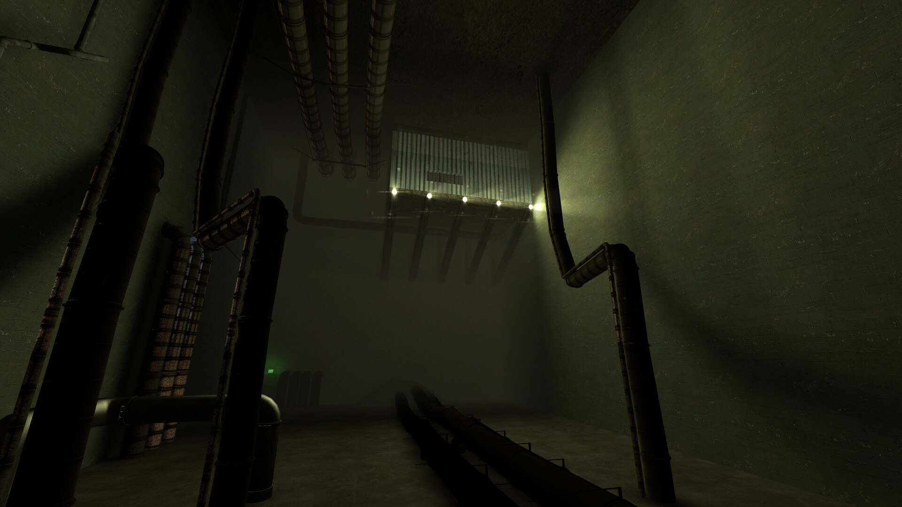
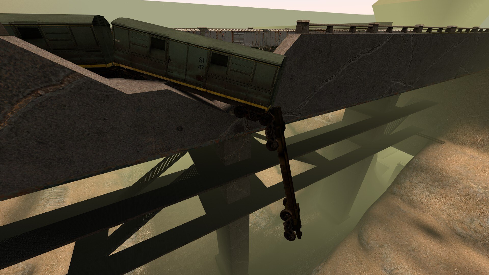
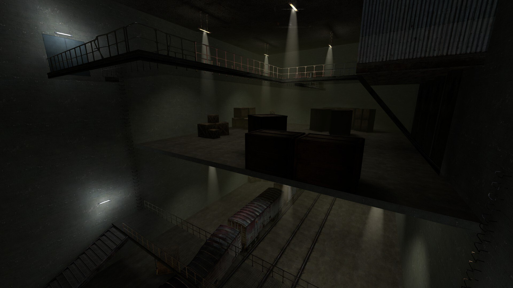
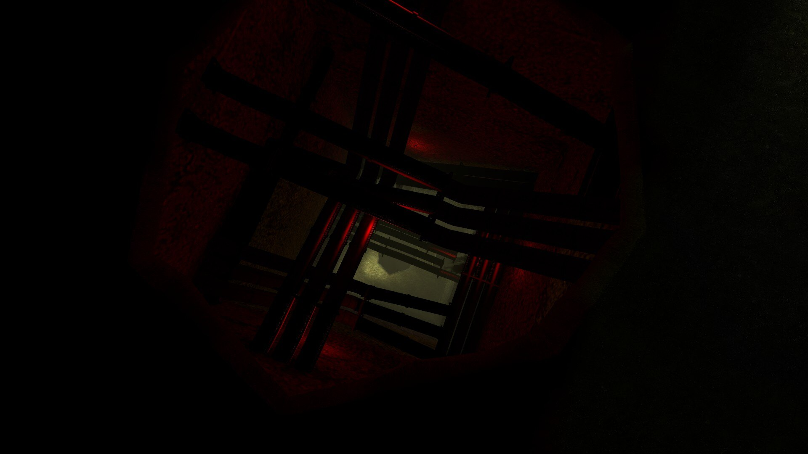


My first Garry's Mod map: a one-off WW3RP event space built around an enormous two-level bridge, a firefight-heavy complex, and sewers meant to make flanking possible.


  <article>
    Type
    <strong>Personal multiplayer map</strong>
    
A Garry's Mod level made for one specific nebulous.cloud WW3RP event rather than years of general-purpose play.

  </article>
  <article>
    Focus
    <strong>Bridge, complex, and flanking network</strong>
    
A direct fight over the bridge and main complex, with a large sewer network giving players another way through.

  </article>
  <article>
    Stack
    <strong>Garry's Mod and Source mapping</strong>
    
My first full Garry's Mod mapping project, with Atmos support and no unnecessary AI node graph for a player-only event.

  </article>


 Garry's Mod 
 Source Engine 
 WW3RP 
 Multiplayer 
 Level Design 


## Everybody Has a First Map

[View rp_bridge_complex on the Steam Workshop](https://steamcommunity.com/sharedfiles/filedetails/?id=736630838).

This was my first published map. I built *rp_bridge_complex* for one specific nebulous.cloud WW3RP event, as an Event Administrator, with a layout based on three things: an enormous two-level bridge, a main combat complex, and a sewer network for players who preferred not to walk directly into the firefight.

## The complex

*Being my first map, I still didn't have an habit of checking for dimensions, or getting references. Because of this, the environments look a bit unnatural and unrealistic, but I think I still managed to make something interesting.*

*The broken railway made the upper bridge memorable, while the second level underneath gave the event another line of movement.*

## The Main Complex

*The complex mixed open floors, overhead walkways, cover, and the railway itself to support firefights across several heights.*
*I enjoy verticality from games like Halo, so I took inspiration.*

*The deeper routes were deliberately oppressive: narrow, dark, and easy to lose your bearings in, but useful for getting around the obvious front line.*

The map supported the popular Atmos addon and skipped the AI node graph because it was built for a live player event, not bots. Some spawn areas and decorative work were rushed, and honestly, I still didn't know how to use displacements properly. Fair enough: it was my first Garry's Mod map, it had a deadline, and I prioritized making the routes playable over pretending every corner was finished.

<!-- Feature image source: https://images.steamusercontent.com/ugc/261592003127206432/22674FEC28D432BC72533B8EE28B626494264B98/ -->
