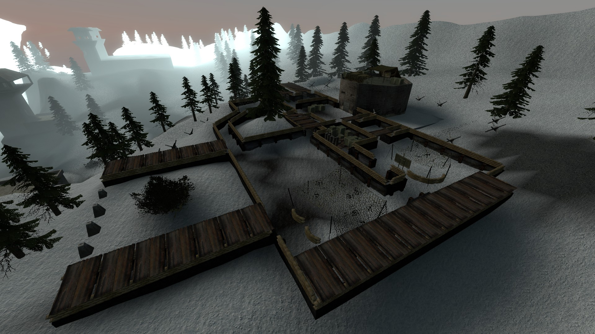
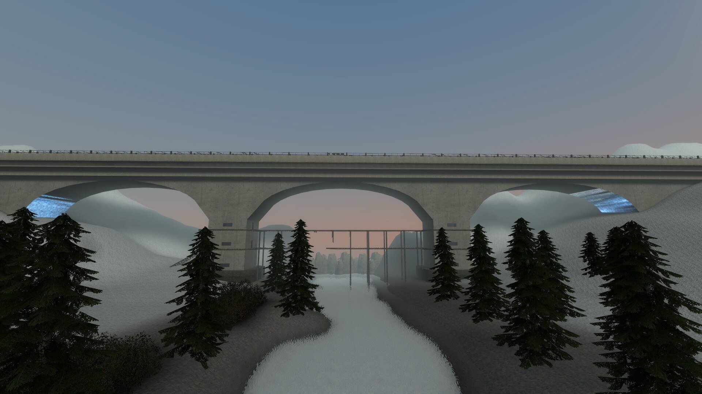
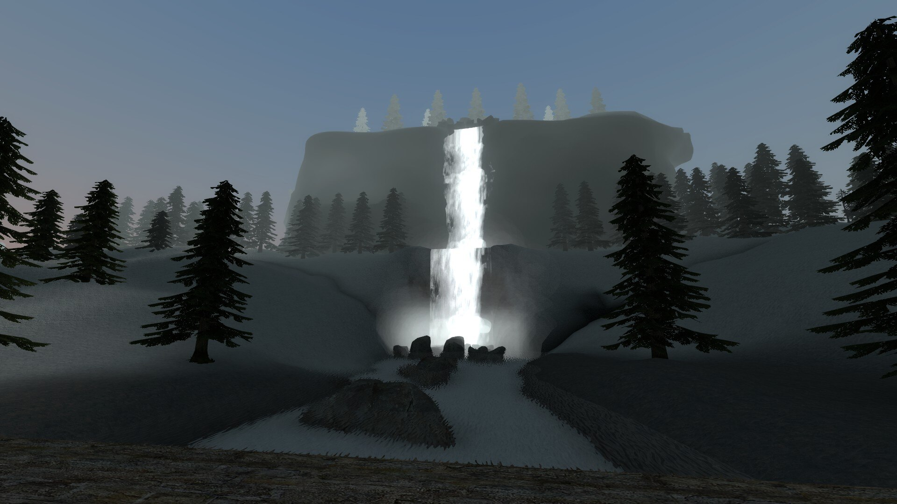
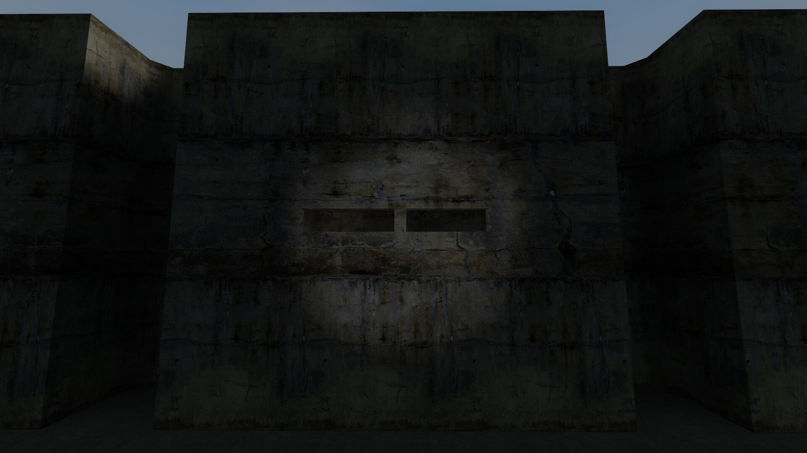
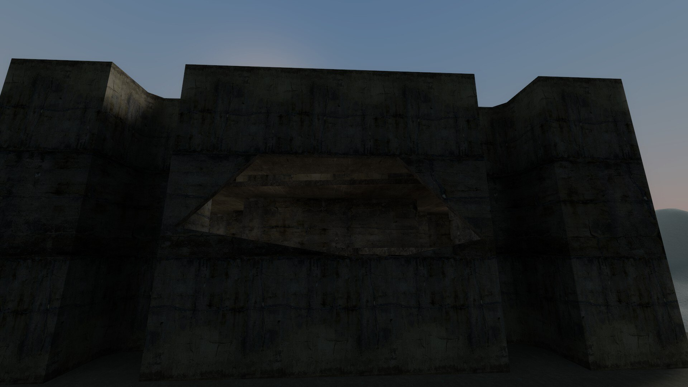


A snowy WW3RP battlefield that I built, along with some help from my friend Zak, for the community at nebulous.cloud. A project that grew into roughly 700 hours of terrain, fortifications, buildings, caves, interactions, and optimization work.


  <article>
    Type
    <strong>Custom multiplayer map</strong>
    
A public Garry's Mod role-play map for the nebulous.cloud community.

  </article>
  <article>
    Focus
    <strong>Large-scale combat space</strong>
    
A large battlefield split into recognizable compounds, trenches, roads, bridges, forests, and caves rather than one enormous empty snowfield.

  </article>
  <article>
    Stack
    <strong>Garry's Mod and Source mapping</strong>
    
Source Engine mapping with custom textures, destructible structures, interactive spaces, and a great deal of visibility work.

  </article>


 Garry's Mod 
 Source Engine 
 WW3RP 
 Multiplayer 
 Level Design 
 Optimization 


## The Released Map

[View rp_wartorn on the Steam Workshop](https://steamcommunity.com/sharedfiles/filedetails/?id=784945599).

My second ever map project, and I scaled it up massively. I spent roughly 700 hours across almost four months building a map that could support one of nebulous.cloud's WW3RP campaigns without just making one enormous, empty snowfield.

## A Battlefield With Actual Landmarks

*Fortified compounds and trench networks broke the terrain into places players could recognize, attack, and defend.*

*The bridge was one of the map's largest landmarks, visible across the valley and exposed enough to make crossing it a commitment.*

*Forests, caves, roads, high ground, and the waterfall helped the quieter parts of the map feel like routes rather than leftover space.*

## Destructible Buildings

The part I still find most interesting is the destructible architecture. WW3RP needed buildings to be more than permanent cover, so some scripted walls and parts of buildings could be blown open and turned into completely new firing positions. At the time I had seen very few role-play maps attempt anything similar (if any) and it gave firefights a kind of escalation that static environments simply could not.

*Before: a closed wall protecting the interior.*

*After: the wall is breached, exposing the room and changing how both sides can fight around it.*

The Workshop release also included interactive elements, an underground cave system (which was cut massively...), and custom textures: the water textures were made by TopHattWaffle.
Despite the scale, the original release targeted roughly 120 FPS on what I considered a medium-end machine in 2016. It requires the usual mounted Source games and a handful of period-specific prop packs, which sadly made the map less playable for other people.

<!-- Feature image source: https://images.steamusercontent.com/ugc/243584730425168799/9219A7EE3AF5DBA21D94459FA7BBE78A715AB443/ -->
