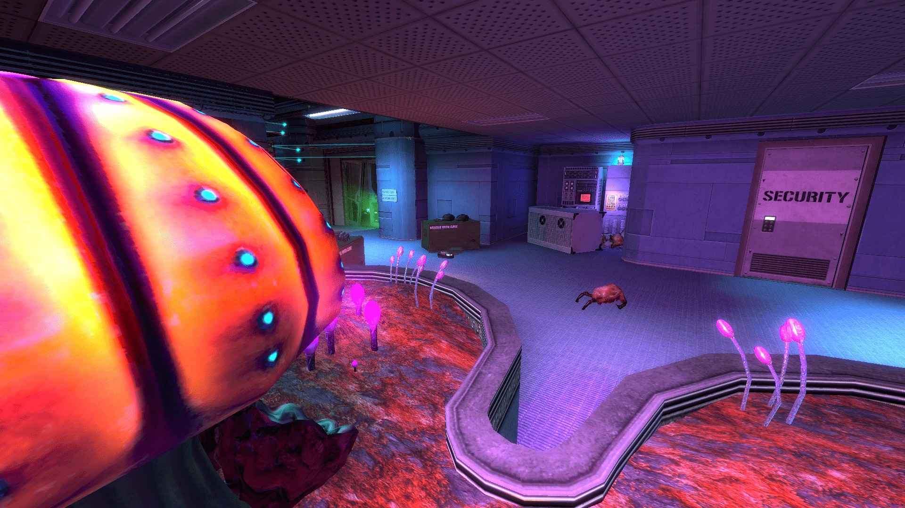
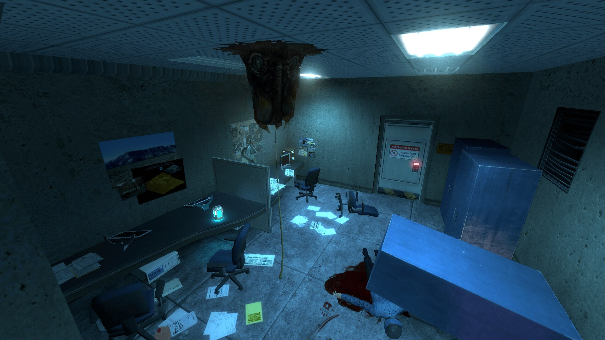
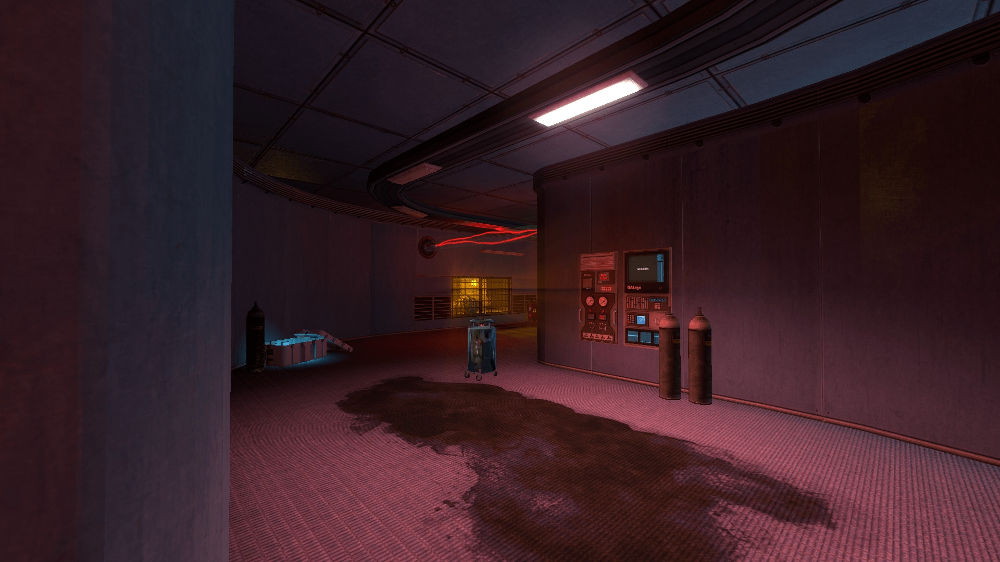
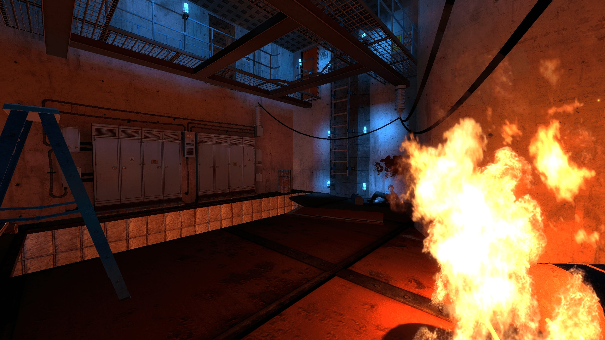


One of my most ambitious Black Mesa maps: a small escape through a wrecked laboratory that eventually opens into a much larger Xen wildlife testing ground.


  <article>
    Type
    <strong>Personal single-player map</strong>
    
A standalone Black Mesa map I spent almost a year building and eventually released through the Steam Workshop.

  </article>
  <article>
    Focus
    <strong>Facility escape and Xen enclosure</strong>
    
The map starts cramped and damaged, then opens into a much larger area full of Xen wildlife and research infrastructure.

  </article>
  <article>
    Stack
    <strong>Black Mesa and Source mapping</strong>
    
A Source Engine level released as a Workshop addon. I also made the VMF available for anyone curious enough to take it apart.

  </article>


 Black Mesa 
 Source Engine 
 Single-player 
 Xen 
 Level Design 


## The Nesting Grounds



[View The Nesting Grounds on the Steam Workshop](https://steamcommunity.com/sharedfiles/filedetails/?id=1584891454).

I released *The Nesting Grounds* in December 2018 after almost a year of work. It was meant as the prologue to *Xen Survivor*: Dr. O'Donnell, one of the surviving Black Mesa Survey Team members, escapes a derelict laboratory and enters a huge testing area used to study Xen wildlife.

The contrast between those two spaces was the whole point. The beginning is enclosed, damaged, and uncomfortable; the map gradually introduces stranger specimens and larger research spaces before finally opening up.

## Inside the Laboratory

*The Xen wildlife is already taking over the laboratory, what was previously used as arrogant exhibits, are now claiming their cage.*

*The quieter rooms carry most of the Resonance Cascade's aftermath: abandoned workstations, broken furniture, blood, and a very recognizeable critter that very clearly should not be in the ceiling.*

*The new lighting introduced in 2018 did a lot of the work. I wanted the route to feel unsafe even when nothing was actively attacking the player.*

*The more industrial spaces gave me room for vertical traversal, environmental hazards, and a little controlled chaos before the exterior section.*

The map also contains combat encounters and an optional generator-room puzzle. That room can still trigger an old physics-related crash; if it happens, the Workshop instructions recommend restarting with `map bm_nest`. Otherwise, the normal launch command is `map nest`.

<!-- Feature image source: https://images.steamusercontent.com/ugc/942838965125455975/F4718F150DB3AD9FE14B5F43AF577B719AC2F5E0/ -->
